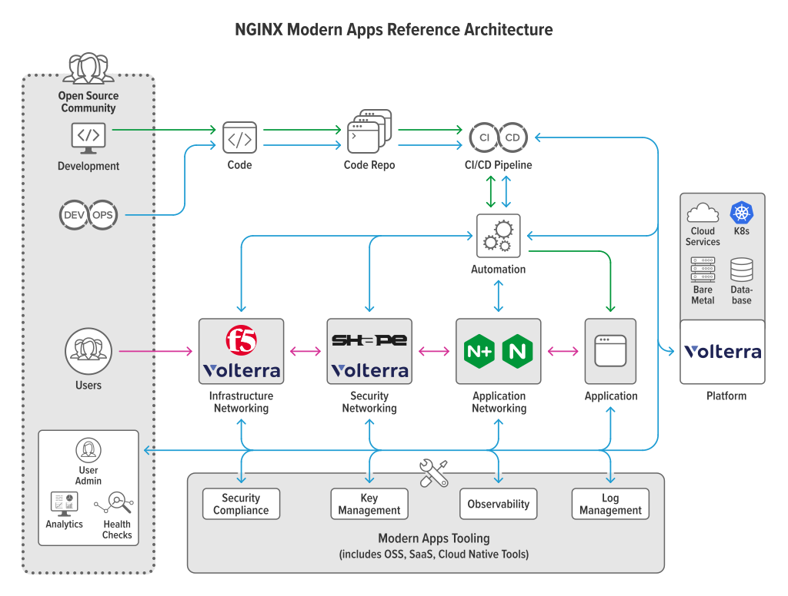

# NGINX Modern Reference Architectures

This repository has the basics for a common way to deploy and manage a modern app. Over time we'll be building more
example architectures using different deployment models and options including other clouds, and you’ll be able to find
those from here.

## Nomenclature

Internally, we refer to this project as MARA for Modern Application Reference Architecture. The current repository name
reflects the humble origins of this project, as it was started for the purpose of allowing users to build custom
versions of the NGINX Ingress Controller. This went so well we decided to expand it out to the project you are now
viewing.

## Modern App Architectures

We define modern app architectures as those driven by four characteristics: *scalability*, *portability*, *resiliency*,
and *agility*. While of course there are many different aspects of a modern architecture, these are fundamental.

This diagram is an example of what we mean by a modern app architecture:

To satisfy the four key characteristics, many modern app architectures employ:

* platform agnosticism,
* prioritize OSS,
* everything defined by Code,
* driven by CI/CD automation,
* security minded development,
* built on containers, and
* distributed storage.

## What's being built

To see details on the current state of this project, please see the
[readme](./pulumi/python/README.md) in the [`pulumi/python`](./pulumi/python) subdirectory. This project is under active
development, and the current work is using [Pulumi](https://www.pulumi.com/) with Python.

This project was started to provide a complete, stealable, easy to deploy, and standalone example of how a modern app
architecture can be built. It was driven by the need to be flexible and not require a long list of dependencies to get
started. It needs to provide examples of tooling used to build this sort of architecture in the real world. Most
importantly, it needs to work. Hopefully this provides a ‘jumping off’ point for someone to build their own
infrastructure.

Subdirectories contained within the root directory separate reference architectures by infrastructure deployment tooling
with additional subdirectories as needed. For example, Pulumi allows the use of multiple languages for deployment. As we
have decided to use Python in our first build, there is a `python` subdirectory under the `pulumi` directory.

## Deployment Tools

### Pulumi

[Pulumi](https://www.pulumi.com/) is an infrastructure as code tool that allows you to write code (node, Python, Go,
etc) that defines cloud infrastructure. Within the [`pulumi`](./pulumi) folder are examples of the pulumi being used to
stand up MARA.

## Contribution

We welcome PRs and issues!

Please refer to the [Contributing Guidelines](CONTRIBUTING.md) when doing a pull request.

## License

All code in this repository is licensed under the
[Apache License v2 license](./LICENSE).

Open source license notices for all projects in this repository can be
found [here](https://app.fossa.com/reports/92595e16-c0b8-4c68-8c76-59696b6ac219).

