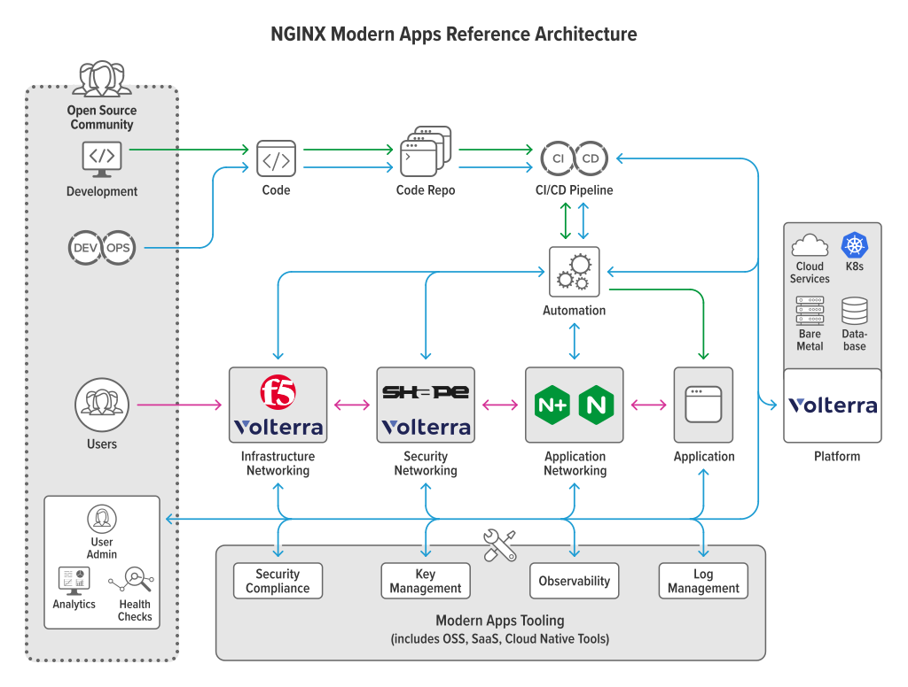

# NGINX Modern Reference Architectures

A repository for modern application deployment and management, 
created to illustrate modern app design principles and encourage 
our community to deploy on Kubernetes. This project provides 
a complete, stealable, easy-to-deploy, and standalone example 
of how a modern app architecture can be built.

## Modern App Architectures
While many different aspects of modern architectures exist, 
we define them as driven by four fundamental characteristics: 
*scalability*, *portability*, *resiliency*, and *agility*. 

* **Scalability** – Quickly and seamlessly scale up or down to accommodate spikes or reductions in demand, anywhere in the world.

* **Portability** – Easy to deploy on multiple types of devices and infrastructures, on public clouds, and on premises.

*	**Resiliency** – Can fail over to newly spun‑up clusters or virtual environments in different availability regions, clouds, or data centers.

*	**Agility** – Ability to update through automated CI/CD pipelines with higher code velocity and more frequent code pushes.

 
 

To satisfy the four key characteristics, many modern app architectures employ:

*	Platform agnosticism
*	Prioritization of OSS
*	Everything defined by code
*	CI/CD automation
*	Security-minded development
*	Containerized builds
*	Distributed storage

## What’s Being Built
This project is under constant development. To see details on its 
current state, head over to the Pulumi [ReadMe](https://github.com/nginxinc/kic-reference-architectures/tree/master/pulumi/aws).

Driven by the need to be flexible and not require a long list of dependencies 
to get started, a modern solution needs to provide examples of tooling used 
to build this style of architecture in the real world. Most importantly, it needs to work. 

We hope this provides a jumping off point for someone to build their own 
infrastructure. Over time, we'll be building more example architectures 
using different deployment models and options including other clouds, 
which you’ll be able to find here.

## Deployment Tools

Subdirectories contained within the root directory separate reference 
architectures by infrastructure deployment tooling.

### Pulumi

[Pulumi](https://www.pulumi.com/) is a modern infrastructure as code 
tool that allows you to write code (node, Python, Go, etc) and define 
cloud infrastructure. Within the [`pulumi`](./pulumi) are examples for 
building and deploying NGINX Kubernetes Ingress Controller (KIC) on 
different cloud environments. 

Pulumi accepts Terraform recipes and automation scripts from nearly all popular coding languages.

## Contribution

We welcome PRs and issues!

Please refer to the [Contributing Guidelines](CONTRIBUTING.md) when doing a pull request.  

## License

All code in this repository is licensed under the
[Apache License v2 license](./LICENSE).

Open source license notices for all projects in this repository can be found [here](https://app.fossa.com/reports/92595e16-c0b8-4c68-8c76-59696b6ac219).

